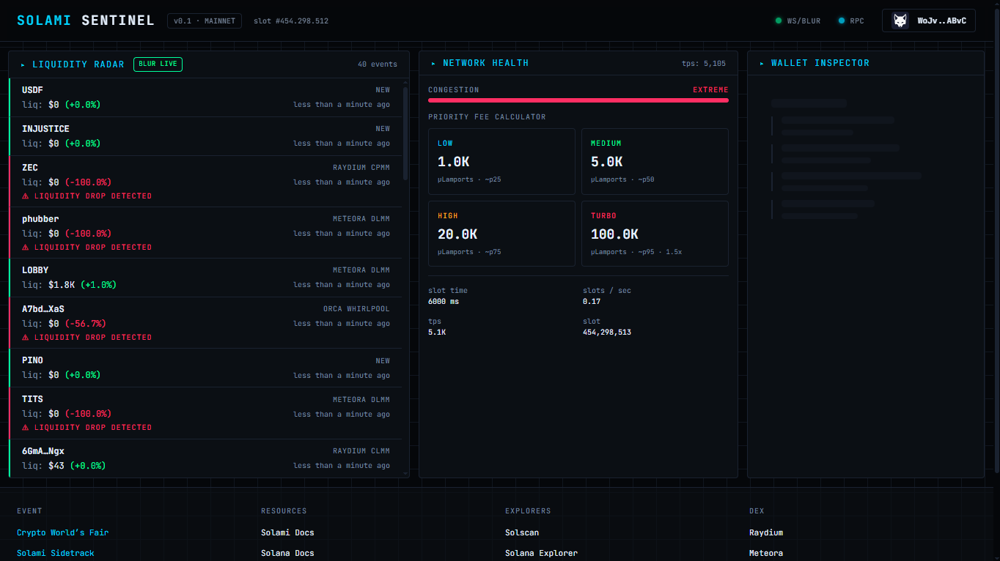
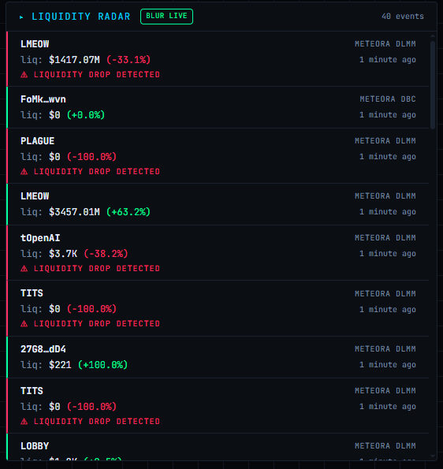
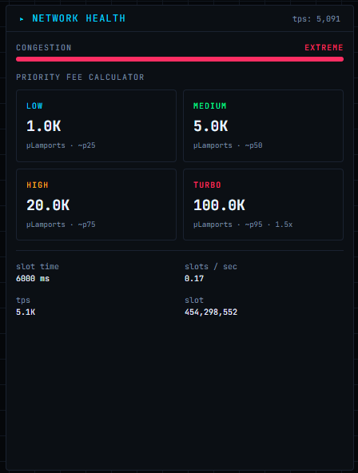
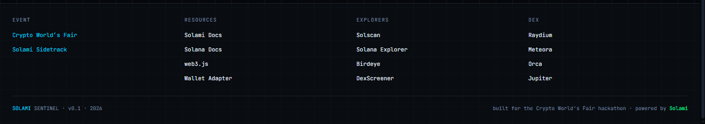

<div align="center">


# Solami Sentinel

**Real-time Solana intelligence dashboard — powered by Solami Blur, RPC & WebSockets.**

[](https://solana.com)
[](https://solami.dev)
[](https://solami.dev/dashboard/blur)
[](./LICENSE)

[English](#english) · [Español](#español)

</div>

---

## English

### 🎯 What is Solami Sentinel?

**Solami Sentinel** is a real-time Solana intelligence dashboard built for the **Crypto World's Fair Hackathon** (Solami Sidetrack). It consumes Solami's decoded market data (**Blur**), RPC and WebSocket infrastructure to deliver three live views in one terminal-style UI:

- 📡 **Liquidity Radar** — Real-time pool events, liquidity changes and token launches across Raydium, Orca, Meteora and PumpSwap. Powered by **Solami Blur WebSocket**.
- 🌐 **Network Health** — Live TPS, slot time, congestion level and a **Priority Fee Calculator** (Low / Medium / High / Turbo). Powered by **Solami RPC**.
- 👛 **Wallet Inspector** — Connect Phantom or Nightly to view SOL balance, SPL token holdings and recent transaction history. Powered by **Solami Blur Data API**.

### 📸 Screenshots

<div align="center">

| Dashboard |
|---|
|  |

| Liquidity Radar | Network Health |
|---|---|
|  |  |

| Wallet Inspector | Footer |
|---|---|
|  |  |

</div>

### 🏗️ Architecture
┌────────────────────────────────────────────────────────────┐
│ Solami Sentinel │
│ │
│ ┌──────────────┐ ┌──────────────┐ ┌──────────────┐ │
│ │ Radar │ │ Network │ │ Wallet │ │
│ │ (Blur WS) │ │ (RPC) │ │ (Blur REST) │ │
│ └──────┬───────┘ └──────┬───────┘ └──────┬───────┘ │
│ │ │ │ │
│ └────────┬────────┴──────────┬───────┘ │
│ │ │ │
│ ┌──────▼──────┐ ┌───────▼───────┐ │
│ │ solami.ws │ │ solami.blur │ │
│ │ solami.rpc │ │ solami.data │ │
│ └──────┬──────┘ └───────┬───────┘ │
│ │ │ │
└──────────────────┼───────────────────┼────────────────────┘
│ │
┌──────────▼──────────┐ ┌─────▼──────────┐
│ Solami Blur WS │ │ Solami RPC │
│ (Primary) │ │ (Primary) │
└──────────┬──────────┘ └─────┬──────────┘
│ │
▼ (fallback) ▼ (fallback)
┌──────────────────┐ ┌────────────────────┐
│ Helius WS │ │ Helius RPC │
└──────────┬───────┘ └─────┬──────────────┘
│ │
▼ ▼
(mock events) (no-op / degrade)


**Design principle:** every data layer has a fallback. Solami → Helius → mock. The UI never breaks.

### 🛠️ Stack

- **Framework:** React 19 + TypeScript + Vite 8
- **Styling:** Tailwind CSS v4 (`@theme` tokens, no config file)
- **Solana:** `@solana/web3.js` + `@solana/wallet-adapter-*`
- **State:** Zustand
- **Data fetching:** TanStack Query v5
- **WebSocket:** `reconnecting-websocket` (native WebSocket wrapper)
- **Charts / Dates:** Recharts, date-fns

### 🚀 Quick Start

```bash
# 1. Clone
git clone https://github.com/leonardod3v-byte/solami-sentinel.git
cd solami-sentinel

# 2. Install
pnpm install

# 3. Configure environment
cp .env.example .env
# → Fill in VITE_SOLAMI_API_KEY and VITE_HELIUS_RPC_URL

# 4. Run
pnpm dev

Open http://localhost:5173.

🔑 Getting API Keys
Solami (required — gives you RPC, Blur WS and Data API):

Sign up at solami.dev/signup?ref=st-earn-sep-26 → 7-day Pro trial free.

Go to API Keys → create a new key with scopes: RPC + DataApi + Streaming bandwidth.

Or create a role with those scopes and assign it to the key.

Copy the sk_... key → VITE_SOLAMI_API_KEY.

Helius (optional — free RPC fallback):

Sign up at dashboard.helius.dev → free tier.

Copy the API key (UUID only, no URL).

Paste in VITE_HELIUS_RPC_URL and VITE_HELIUS_WS_URL.

🧪 Mock Mode
Set VITE_USE_MOCK=true in .env to bypass all external APIs and use simulated events. Useful for UI development or when APIs are down.

📊 Metrics Tracked
Radar

Pool creations (pool_create)

Liquidity adds/removes (liquidity)

Token launches (token_create)

Metadata resolution (name, symbol, logo)

Network

Live TPS (via performance samples)

Average slot time (ms)

Slots per second

Congestion level (low / medium / high / extreme)

Priority fees by percentile: p25 (Low), p50 (Medium), p75 (High), p95×1.5 (Turbo)

Wallet

SOL balance

SPL token holdings (name, symbol, amount)

Recent transaction history with Solscan links

🗺️ Roadmap
☑ Blur WS integration for Radar
☑ Solami RPC for Network Health
☑ Blur REST for Wallet Inspector
☑ Multi-layer fallbacks (Solami → Helius → mock)
□ Mirage (Yellowstone gRPC over WebSocket) for advanced filtering
□ PnL tracking (Blur /data/wallet/pnl)
□ Webhooks integration for alerting
□ Beam (transaction landing) for co-signing
□ Historical charts (liquidity over time)
🎥 Demo
Watch the 2-minute demo → (link to be added)

📄 License
MIT — see LICENSE.

🙏 Credits
Built during the Crypto World's Fair Hackathon (Solami Sidetrack).

Solami — RPC, Blur decoded market data, WebSocket infrastructure.

Solana — the chain.

Helius — resilient RPC fallback.